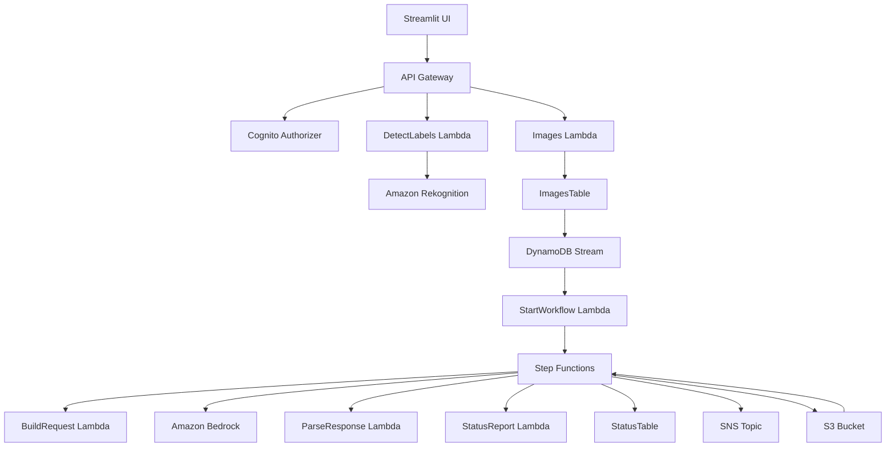

# SAM to CDK Migration Design Document

## Overview

This document outlines the design for migrating an existing SAM-based image processing application to AWS CDK TypeScript. The application automates background changes in images using Amazon Bedrock, Step Functions, and various AWS services. The migration will maintain functional parity while leveraging CDK's infrastructure-as-code capabilities and TypeScript's type safety.

## Architecture

### High-Level Architecture



### CDK Stack Architecture

The application will be organized into modular CDK stacks for maintainability and reusability:

```
ImageProcessingApp
├── StorageStack (S3, DynamoDB)
├── AuthStack (Cognito)
├── ApiStack (API Gateway, Lambda functions)
├── ComputeStack (Processing Lambda functions)
├── OrchestrationStack (Step Functions)
└── NotificationStack (SNS)
```

## Components and Interfaces

### 1. Storage Stack (`lib/constructs/storage-stack.ts`)

**Purpose**: Manages data storage components including S3 bucket and DynamoDB tables.

**Components**:
- **S3 Bucket**: Image storage with versioning and encryption
- **ImagesTable**: DynamoDB table for image metadata with stream enabled
- **StatusTable**: DynamoDB table for processing status tracking

**Key Interfaces**:
```typescript
interface StorageStackProps extends StackProps {
  bucketName: string;
  imagePrefix: string;
  processedPrefix: string;
}

interface StorageStackOutputs {
  bucket: s3.Bucket;
  imagesTable: dynamodb.Table;
  statusTable: dynamodb.Table;
}
```

**AWS Solutions Constructs Used**:
- Custom S3 bucket configuration with security best practices
- DynamoDB tables with encryption and stream configuration

### 2. Authentication Stack (`lib/constructs/auth-stack.ts`)

**Purpose**: Handles user authentication and authorization.

**Components**:
- **Cognito User Pool**: User authentication with password policies
- **Cognito User Pool Client**: Application client with secret
- **API Gateway Authorizer**: Cognito-based authorization

**Key Interfaces**:
```typescript
interface AuthStackProps extends StackProps {
  userPoolName: string;
  clientName: string;
}

interface AuthStackOutputs {
  userPool: cognito.UserPool;
  userPoolClient: cognito.UserPoolClient;
  authorizer: apigateway.CognitoUserPoolsAuthorizer;
}
```

### 3. API Stack (`lib/constructs/api-stack.ts`)

**Purpose**: Exposes REST API endpoints for the application.

**Components**:
- **API Gateway REST API**: Main API with CORS configuration
- **DetectLabels Lambda**: Rekognition integration
- **Images Lambda**: DynamoDB integration for metadata

**AWS Solutions Constructs Used**:
- `aws-cognito-apigateway-lambda`: Secure API with Cognito authentication
- `aws-apigateway-dynamodb`: Direct API-to-DynamoDB integration where appropriate

**Key Interfaces**:
```typescript
interface ApiStackProps extends StackProps {
  authorizer: apigateway.CognitoUserPoolsAuthorizer;
  imagesTable: dynamodb.Table;
  apiName: string;
}

interface ApiStackOutputs {
  api: apigateway.RestApi;
  apiUrl: string;
}
```

### 4. Compute Stack (`lib/constructs/compute-stack.ts`)

**Purpose**: Contains Lambda functions for image processing workflow.

**Components**:
- **StartImageProcessingWorkflowFunction**: DynamoDB stream trigger
- **BuildBedrockRequestFunction**: Constructs Bedrock requests
- **ParseBedrockResponseFunction**: Processes Bedrock responses
- **GenerateStatusReportFunction**: Creates processing reports

**AWS Solutions Constructs Used**:
- `aws-dynamodbstreams-lambda`: Stream processing trigger
- `aws-lambda-s3`: S3 integration for image access
- `aws-lambda-sns`: Notification integration

**Key Interfaces**:
```typescript
interface ComputeStackProps extends StackProps {
  bucket: s3.Bucket;
  imagesTable: dynamodb.Table;
  statusTable: dynamodb.Table;
  snsTopic: sns.Topic;
  bedrockModelId: string;
}

interface ComputeStackOutputs {
  startWorkflowFunction: lambda.Function;
  buildRequestFunction: lambda.Function;
  parseResponseFunction: lambda.Function;
  statusReportFunction: lambda.Function;
}
```

### 5. Orchestration Stack (`lib/constructs/orchestration-stack.ts`)

**Purpose**: Manages the Step Functions state machine for image processing workflow.

**Components**:
- **Step Functions State Machine**: Orchestrates the entire processing workflow
- **IAM Roles**: Execution roles with appropriate permissions

**AWS Solutions Constructs Used**:
- `aws-lambda-stepfunctions`: Lambda-to-Step Functions integration
- Custom Step Functions definition with Bedrock integration

**Key Interfaces**:
```typescript
interface OrchestrationStackProps extends StackProps {
  computeFunctions: ComputeStackOutputs;
  bucket: s3.Bucket;
  statusTable: dynamodb.Table;
  snsTopic: sns.Topic;
  bedrockModelId: string;
  maxConcurrency: number;
}

interface OrchestrationStackOutputs {
  stateMachine: stepfunctions.StateMachine;
}
```

### 6. Notification Stack (`lib/constructs/notification-stack.ts`)

**Purpose**: Handles notifications for processing completion.

**Components**:
- **SNS Topic**: Email notifications
- **SNS Subscription**: Email endpoint configuration

**AWS Solutions Constructs Used**:
- `aws-lambda-sns`: Lambda-to-SNS integration
- `aws-s3-sns`: S3-to-SNS integration if needed

**Key Interfaces**:
```typescript
interface NotificationStackProps extends StackProps {
  topicName: string;
  notificationEmail: string;
}

interface NotificationStackOutputs {
  topic: sns.Topic;
}
```

## Data Models

### Configuration Parameters

```typescript
interface ImageProcessingConfig {
  // API Configuration
  apiName: string;
  
  // Storage Configuration
  bucketName: string;
  imagePrefix: string;
  processedPrefix: string;
  
  // Bedrock Configuration
  bedrockModelId: string;
  maxConcurrency: number;
  
  // Notification Configuration
  snsTopicName: string;
  notificationEmail: string;
  
  // Status Report Configuration
  statusReportUrlExpiration: number;
  
  // Authentication Configuration
  userPoolName: string;
  clientName: string;
}
```

### DynamoDB Table Schemas

**ImagesTable**:
```typescript
interface ImageRecord {
  id: string; // Partition key
  originalImageKey: string;
  processedImageKey?: string;
  status: 'PENDING' | 'PROCESSING' | 'COMPLETED' | 'FAILED';
  createdAt: string;
  updatedAt: string;
  metadata?: Record<string, any>;
}
```

**StatusTable**:
```typescript
interface StatusRecord {
  id: string; // Partition key (HASH)
  imageName: string; // Sort key (RANGE)
  status: string;
  message?: string;
  timestamp: string;
  details?: Record<string, any>;
}
```

## Error Handling

### Lambda Function Error Handling

1. **Structured Error Responses**: All Lambda functions return consistent error structures
2. **Retry Logic**: Implement exponential backoff for transient failures
3. **Dead Letter Queues**: Configure DLQs for failed Lambda invocations
4. **CloudWatch Alarms**: Monitor error rates and trigger notifications

### Step Functions Error Handling

1. **Retry Policies**: Configure retry attempts for each state
2. **Catch Blocks**: Handle specific error types with appropriate fallback actions
3. **Timeout Configuration**: Set appropriate timeouts for each state
4. **Error State**: Final error state for unrecoverable failures

### API Gateway Error Handling

1. **HTTP Status Codes**: Return appropriate HTTP status codes
2. **Error Response Format**: Consistent error response structure
3. **Rate Limiting**: Implement throttling to prevent abuse
4. **CORS Configuration**: Proper CORS headers for browser compatibility

## Testing Strategy

### Unit Testing

1. **Lambda Functions**: Test individual function logic with mocked dependencies
2. **CDK Constructs**: Test construct creation and property validation
3. **Utility Functions**: Test helper functions and data transformations

### Integration Testing

1. **API Endpoints**: Test API Gateway integration with Lambda functions
2. **DynamoDB Operations**: Test database read/write operations
3. **Step Functions**: Test state machine execution with sample data
4. **S3 Operations**: Test file upload/download operations

### End-to-End Testing

1. **Complete Workflow**: Test entire image processing pipeline
2. **Error Scenarios**: Test error handling and recovery mechanisms
3. **Performance Testing**: Validate processing times and concurrency limits
4. **Security Testing**: Verify authentication and authorization

### CDK Testing

1. **Snapshot Testing**: Verify CloudFormation template generation
2. **Fine-Grained Assertions**: Test specific resource properties
3. **CDK Nag Integration**: Ensure security best practices compliance

## Security Considerations

### IAM Permissions

1. **Least Privilege**: Grant minimum required permissions to each service
2. **Resource-Specific Policies**: Limit access to specific resources
3. **Cross-Service Access**: Secure communication between services
4. **Service Roles**: Use service-linked roles where appropriate

### Data Encryption

1. **S3 Encryption**: Enable server-side encryption for S3 bucket
2. **DynamoDB Encryption**: Enable encryption at rest for DynamoDB tables
3. **SNS Encryption**: Encrypt SNS messages in transit
4. **Lambda Environment Variables**: Encrypt sensitive environment variables

### Network Security

1. **VPC Configuration**: Deploy Lambda functions in VPC if required
2. **Security Groups**: Configure appropriate security group rules
3. **API Gateway**: Enable request validation and throttling
4. **CORS Configuration**: Restrict CORS to specific origins

### CDK Nag Compliance

1. **Security Rules**: Apply CDK Nag to all stacks
2. **Suppression Documentation**: Document any security rule suppressions
3. **Regular Audits**: Periodically review and update security configurations

## Deployment Strategy

### Environment Configuration

1. **Parameter Store**: Store configuration parameters in SSM Parameter Store
2. **Environment Variables**: Use environment-specific variables
3. **Stack Naming**: Implement consistent naming conventions
4. **Resource Tagging**: Apply consistent tags for cost tracking and management

### CI/CD Pipeline

1. **Build Stage**: Compile TypeScript and run tests
2. **Security Scan**: Run CDK Nag and security checks
3. **Deployment Stage**: Deploy to staging and production environments
4. **Validation Stage**: Run integration tests post-deployment

### Rollback Strategy

1. **CloudFormation Rollback**: Leverage CloudFormation's rollback capabilities
2. **Blue-Green Deployment**: Implement blue-green deployment for zero downtime
3. **Database Migration**: Handle DynamoDB schema changes carefully
4. **Monitoring**: Monitor deployment health and trigger rollback if needed

## Monitoring and Observability

### CloudWatch Integration

1. **Lambda Metrics**: Monitor function duration, errors, and invocations
2. **API Gateway Metrics**: Track request counts, latency, and error rates
3. **Step Functions Metrics**: Monitor execution success/failure rates
4. **Custom Metrics**: Implement business-specific metrics

### X-Ray Tracing

1. **Distributed Tracing**: Enable X-Ray for Lambda functions and Step Functions
2. **Service Map**: Visualize service dependencies and performance
3. **Error Analysis**: Identify bottlenecks and error patterns

### Logging Strategy

1. **Structured Logging**: Use JSON format for log entries
2. **Log Aggregation**: Centralize logs in CloudWatch Logs
3. **Log Retention**: Configure appropriate retention policies
4. **Log Analysis**: Use CloudWatch Insights for log analysis

## Performance Optimization

### API Gateway Direct Service Integration

**DetectLabels Endpoint**:
```typescript
const rekognitionIntegration = new apigateway.AwsIntegration({
  service: 'rekognition',
  action: 'DetectLabels',
  integrationHttpMethod: 'POST',
  options: {
    credentialsRole: rekognitionRole,
    requestParameters: {
      'integration.request.header.Content-Type': "'application/x-amz-json-1.1'",
      'integration.request.header.X-Amz-Target': "'RekognitionService.DetectLabels'"
    }
  }
});
```

**Images Endpoint with VTL Template**:
```typescript
const dynamoIntegration = new apigateway.AwsIntegration({
  service: 'dynamodb',
  action: 'PutItem',
  integrationHttpMethod: 'POST',
  options: {
    credentialsRole: dynamoRole,
    requestParameters: {
      'integration.request.header.Content-Type': "'application/x-amz-json-1.1'",
      'integration.request.header.X-Amz-Target': "'DynamoDB_20120810.PutItem'"
    },
    requestTemplates: {
      'application/json': vtlTemplate // Complex VTL from SAM template
    }
  }
});
```

### Lambda Configuration Details

```typescript
const startWorkflowFunction = new lambda.Function(this, 'StartWorkflow', {
  memorySize: 128,
  timeout: cdk.Duration.seconds(120),
  environment: {
    STATE_MACHINE_IMAGE_PROCESSING_ARN: stateMachine.stateMachineArn,
    INPUT_BUCKET: bucket.bucketName,
    IMAGE_PREFIX: props.imagePrefix,
    GENERATED_IMAGE_PREFIX: props.generatedImagePrefix,
    STATUS_REPORT_PREFIX: props.statusReportPrefix
  }
});

const buildRequestFunction = new lambda.Function(this, 'BuildRequest', {
  memorySize: 512,
  ephemeralStorageSize: cdk.Size.mebibytes(1024),
  timeout: cdk.Duration.seconds(900)
});

const parseResponseFunction = new lambda.Function(this, 'ParseResponse', {
  memorySize: 512,
  ephemeralStorageSize: cdk.Size.mebibytes(1024),
  timeout: cdk.Duration.seconds(900)
});

const statusReportFunction = new lambda.Function(this, 'StatusReport', {
  memorySize: 128,
  timeout: cdk.Duration.seconds(900),
  environment: {
    STATUS_TABLE: statusTable.tableName,
    STATUS_REPORT_URL_EXPIRATION: props.statusReportUrlExpiration.toString()
  }
});
```

### DynamoDB Configuration

```typescript
const imagesTable = new dynamodb.Table(this, 'ImagesTable', {
  partitionKey: { name: 'Id', type: dynamodb.AttributeType.STRING },
  billingMode: dynamodb.BillingMode.PAY_PER_REQUEST,
  encryption: dynamodb.TableEncryption.AWS_MANAGED,
  stream: dynamodb.StreamViewType.NEW_IMAGE
});

const statusTable = new dynamodb.Table(this, 'StatusTable', {
  partitionKey: { name: 'Id', type: dynamodb.AttributeType.STRING },
  sortKey: { name: 'ImageName', type: dynamodb.AttributeType.STRING },
  billingMode: dynamodb.BillingMode.PAY_PER_REQUEST,
  encryption: dynamodb.TableEncryption.AWS_MANAGED
});

// DynamoDB Stream Event Source
startWorkflowFunction.addEventSource(new lambdaEventSources.DynamoEventSource(imagesTable, {
  startingPosition: lambda.StartingPosition.LATEST,
  batchSize: 1
}));
```

### Cognito Configuration

```typescript
const userPool = new cognito.UserPool(this, 'UserPool', {
  autoVerify: { email: true },
  signInAliases: { email: true },
  selfSignUpEnabled: false, // AdminCreateUserOnly
  passwordPolicy: {
    minLength: 8,
    requireLowercase: true,
    requireNumbers: true,
    requireSymbols: true,
    requireUppercase: true
  },
  removalPolicy: cdk.RemovalPolicy.DESTROY
});

const userPoolClient = new cognito.UserPoolClient(this, 'UserPoolClient', {
  userPool,
  generateSecret: true
});
```

### Step Functions IAM Role

```typescript
const statesExecutionRole = new iam.Role(this, 'StatesExecutionRole', {
  assumedBy: new iam.ServicePrincipal('states.amazonaws.com'),
  inlinePolicies: {
    BedrockPolicy: new iam.PolicyDocument({
      statements: [
        new iam.PolicyStatement({
          effect: iam.Effect.ALLOW,
          actions: ['bedrock:InvokeModel'],
          resources: [`arn:aws:bedrock:${cdk.Stack.of(this).region}::foundation-model/amazon.titan-image-generator-v1`]
        })
      ]
    }),
    XRayPolicy: new iam.PolicyDocument({
      statements: [
        new iam.PolicyStatement({
          effect: iam.Effect.ALLOW,
          actions: [
            'xray:PutTraceSegments',
            'xray:PutTelemetryRecords', 
            'xray:GetSamplingRules',
            'xray:GetSamplingTargets'
          ],
          resources: ['*']
        })
      ]
    })
  }
});
```

### DynamoDB Optimization

1. **Capacity Planning**: Use on-demand billing for variable workloads
2. **Index Strategy**: Create appropriate GSIs for query patterns
3. **Batch Operations**: Use batch operations for bulk data processing
4. **Connection Pooling**: Optimize DynamoDB client configuration

### Step Functions Optimization

1. **Parallel Processing**: Use parallel states where appropriate
2. **Map State**: Leverage distributed map for concurrent processing
3. **State Optimization**: Minimize state transitions and data passing
4. **Timeout Configuration**: Set appropriate timeouts for each state

## Migration Considerations

### Compatibility Requirements

1. **API Compatibility**: Maintain existing API contract for Streamlit UI
2. **Data Format**: Ensure DynamoDB data format compatibility
3. **S3 Structure**: Maintain existing S3 bucket structure and naming
4. **Configuration**: Support existing configuration parameters

### Migration Steps

1. **Infrastructure Deployment**: Deploy CDK stacks to new environment
2. **Data Migration**: Migrate existing DynamoDB data if needed
3. **Testing**: Comprehensive testing with existing UI
4. **Cutover**: Switch DNS/configuration to new infrastructure
5. **Cleanup**: Remove old SAM resources after validation

### Rollback Plan

1. **Infrastructure Rollback**: Keep old SAM template for emergency rollback
2. **Data Synchronization**: Ensure data consistency during migration
3. **Configuration Rollback**: Ability to switch back to old endpoints
4. **Monitoring**: Enhanced monitoring during migration period